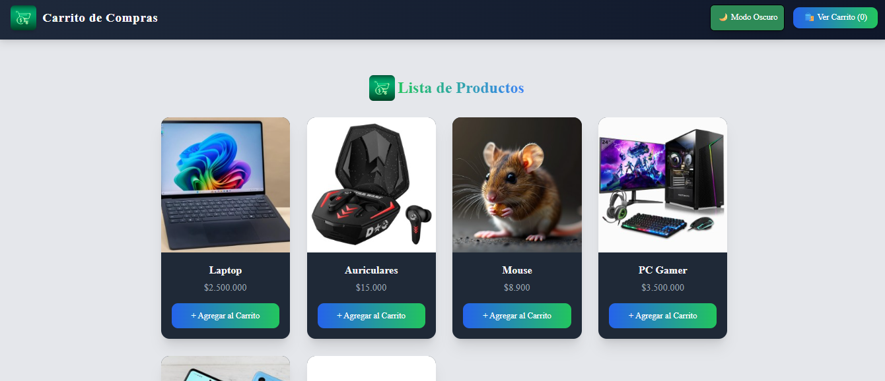
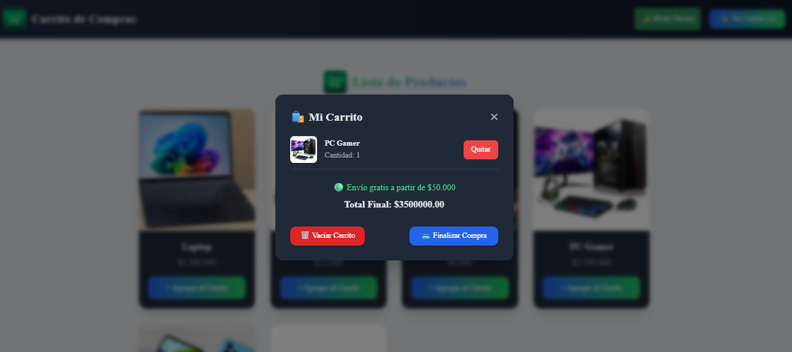

<h1 align="center">🛒 Carrito de Compras Isa</h1>

<p align="center">
  <b>Proyecto desarrollado con React + Vite + Tailwind CSS</b><br/>
  Implementa Context API, animaciones con Framer Motion y notificaciones visuales con React Toastify.
</p>


## 📸 Vista previa

<p align="center">
  
  <br/><br/>
  
</p>
--
## 🌐 Demo en línea
🔗 [carritodecomprasisa.netlify.app](https://carritodecomprasisa.netlify.app)

---

## 🚀 Tecnologías utilizadas

<div align="center">


</div>

---

## 💡 Funcionalidades principales

✅ Agregar, eliminar y modificar cantidad de productos.  
✅ Vaciar carrito con confirmación visual (`toast`).  
✅ Cálculo dinámico de descuentos y envío.  
✅ Modal animado con **Framer Motion**.  
✅ Persistencia con **LocalStorage**.  
✅ Notificaciones de acción con **React Toastify**.  
✅ Modo claro/oscuro mediante **ThemeContext**.  
✅ Diseño moderno y responsive.

---

## 🧮 Lógica destacada

El carrito calcula automáticamente descuentos y envío:

```js
const shipping = totalPrice > 50000 ? 0 : 5000;
const discount = totalItems >= 3 ? totalPrice * 0.1 : 0;
const finalTotal = totalPrice - discount + shipping;
🔹 “Envío gratis a partir de $50.000”
🔹 “Descuento del 10% al comprar 3 o más productos”

⚙️ Instalación y ejecución
bash
Copiar código
# Clonar el repositorio
git clone https://github.com/Isabensa/CarritoDeComprasIsa.git

# Instalar dependencias
npm install

# Ejecutar el entorno local
npm run dev
Accedé en tu navegador a 👉 http://localhost:5173

🧠 Estructura del proyecto
arduino
Copiar código
CarritoDeComprasIsa/
│
├── public/
│   ├── images/
│   ├── vistaprevia1.png
│   └── vistaprevia2.png
│
├── src/
│   ├── components/
│   ├── context/
│   ├── App.jsx
│   ├── main.jsx
│   └── index.css
│
├── package.json
├── tailwind.config.js
└── vite.config.js
🌟 Créditos
👩‍💻 Isabel Bensadón - Desarrolladora Fullstack MERN · Educadora Tecnológica
